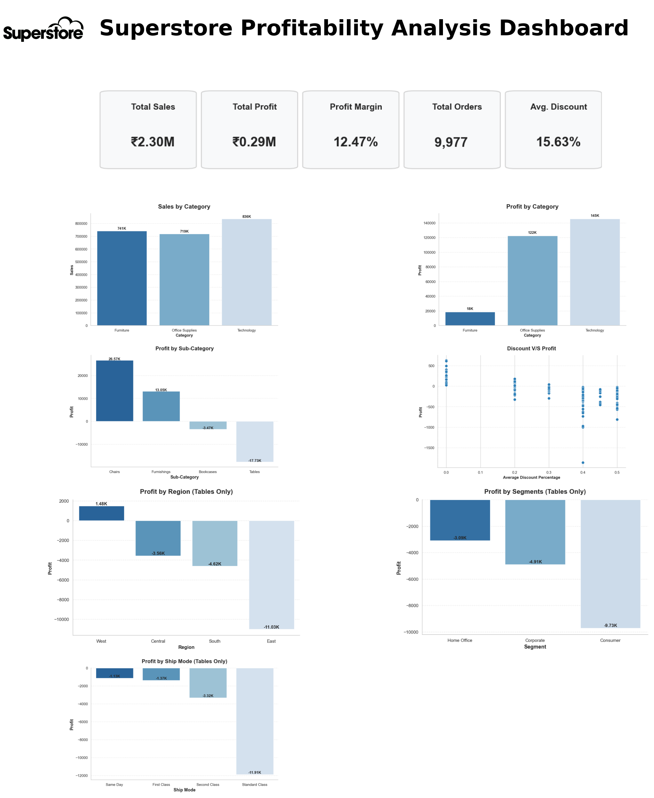

# 📊 Superstore Profitability Analysis Dashboard

## 📌 Project Overview

This project presents a business-focused profitability analysis of the Superstore dataset using Python, Matplotlib, and Seaborn.

The objective of this dashboard is to identify the major factors affecting business profitability by analyzing product categories, furniture sub-categories, discount levels, regions, customer segments, and shipping modes.

The dashboard is designed to help business stakeholders quickly identify loss-making areas and support data-driven decision making.


## 🎯 Business Problem

Although the company generates strong sales across multiple product categories, profitability is not consistent.

The objective of this project is to identify the key business factors responsible for lower profitability and provide actionable insights that can help improve overall business performance.


## 📂 Dataset

- Dataset: Sample Superstore
- Source: Kaggle
- Domain: Retail Sales
- Records: 9,977
- Features: 13


## 🛠 Tools & Libraries

- Python
- Pandas
- NumPy
- Matplotlib
- Seaborn
- Jupyter Notebook
- Git
- GitHub


## 📁 Repository Structure

```text
CodeAlpha_DataVisualization_Task3/

├── Dashboard/
├── Dataset/
├── Notebook/
├── Report/
├── Visualizations/
└── README.md
```


## 📷 Dashboard Preview




## 📈 Dashboard KPIs

- Total Sales: ₹2.30M
- Total Profit: ₹0.29M
- Profit Margin: 12.47%
- Total Orders: 9,977
- Average Discount: 15.63%


## ❓ Business Questions Answered

- Which product category generates the highest sales and profit?
- Which furniture sub-category contributes the highest losses?
- How do discounts affect profitability?
- Which region performs the best and worst?
- Which customer segment contributes the highest profit?
- Which shipping mode is the most profitable?


## 📊 Dashboard Visualizations

- Sales by Category
- Profit by Category
- Profit by Furniture Sub-Category
- Discount vs Profit Analysis
- Profit by Region
- Profit by Customer Segment
- Profit by Shipping Mode


## 💡 Key Business Insights

- Technology generated the highest sales and overall profit.
- Furniture generated strong sales but comparatively low profitability.
- Tables were identified as the biggest loss-making furniture sub-category.
- Higher discounts showed a negative relationship with profit.
- The East region contributed the lowest profitability.
- The Consumer segment showed the largest losses within the Tables analysis.
- Standard Class shipping performed better than faster shipping modes in terms of profitability.


## 🚀 Business Recommendations

- Review pricing and discount strategies for the Tables sub-category.
- Optimize discount policies to improve profit margins without significantly affecting sales.
- Investigate the causes of low profitability in the East region.
- Develop targeted strategies for lower-performing customer segments.
- Evaluate the cost efficiency of Same Day shipping.
- Continuously monitor profitability using business dashboards to support data-driven decision-making.


## 🎯 Skills Demonstrated

- Exploratory Data Analysis (EDA)
- Business Problem Solving
- Data Visualization
- Dashboard Design
- Business Storytelling
- Statistical Analysis
- Python Programming
- Pandas
- Matplotlib
- Seaborn
- Git & GitHub


## 📚 Project Outcomes

This project demonstrates how data visualization can transform raw business data into meaningful insights that support strategic decision-making.

The dashboard provides an executive-level overview of profitability while enabling deeper analysis across products, discounts, regions, customer segments, and shipping methods.


## ⭐ Repository Highlights

✔ Business-focused dashboard

✔ Executive KPI cards

✔ Professional visualizations

✔ Business insights and recommendations

✔ Clean repository structure

✔ Portfolio-ready documentation


## 👨‍💻 About Me

**Saharsh Anant Sarde**

Aspiring Data Analyst passionate about solving business problems using Python, SQL, Excel, Power BI, and Data Visualization.

- LinkedIn: https://www.linkedin.com/in/saharsh-sarde-1706782a8/
- GitHub: https://github.com/Saharsh-DataAnalytics
